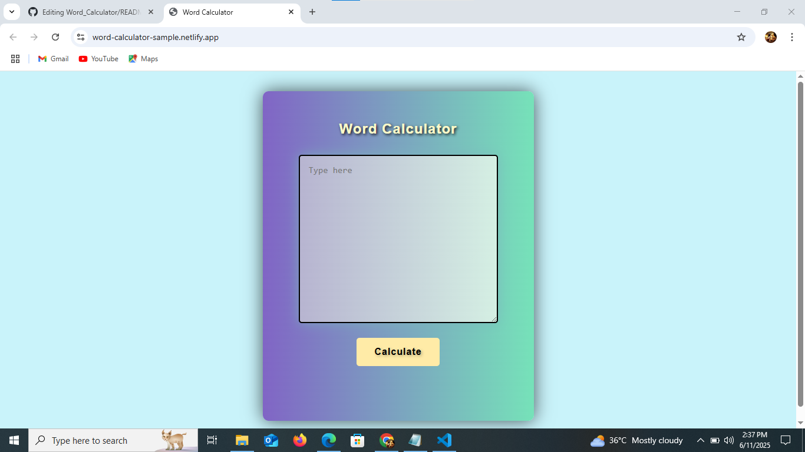
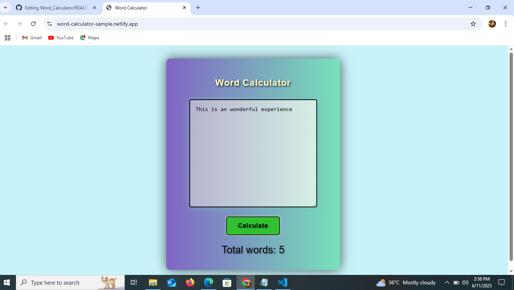

# Word Calculator

A simple and efficient **Word Counter** built with **HTML**, **CSS**, and **JavaScript**. This tool counts the number of words in a given paragraph or sentence, making it useful for writing, editing, and productivity.

## Demo

🔗 [Live Demo](https://word-calculator-sample.netlify.app/)  

## Developed By
**Gayathri G**  
GitHub: [GAYATHRI1006](https://github.com/GAYATHRI1006)

## Screenshot

  
  

## Features

- Counts the number of words in a textarea input
- Trims spaces and filters out extra gaps
- Simple, minimal interface
- Input validation included

## How to Use

1. Open the `index.html` file in your browser.
2. Type or paste a sentence or paragraph in the text area.
3. Click the **Calculate** button.
4. The total number of words will be displayed.

## Input Validation

- If the input is empty or only spaces:  
  `Please enter the words`

## Logic Behind

- `.trim()` removes leading/trailing spaces
- `.split(' ')` splits text into an array by spaces
- `.filter(word => word.length > 0)` removes empty strings
- `words.length` gives the final word count

## Technologies Used

- **HTML** – Page structure
- **CSS** – External styling (linked as `style.css`)
- **JavaScript** – Logic for counting words and validation
